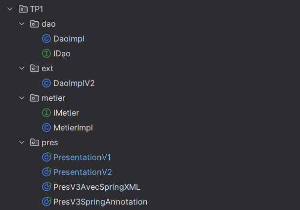
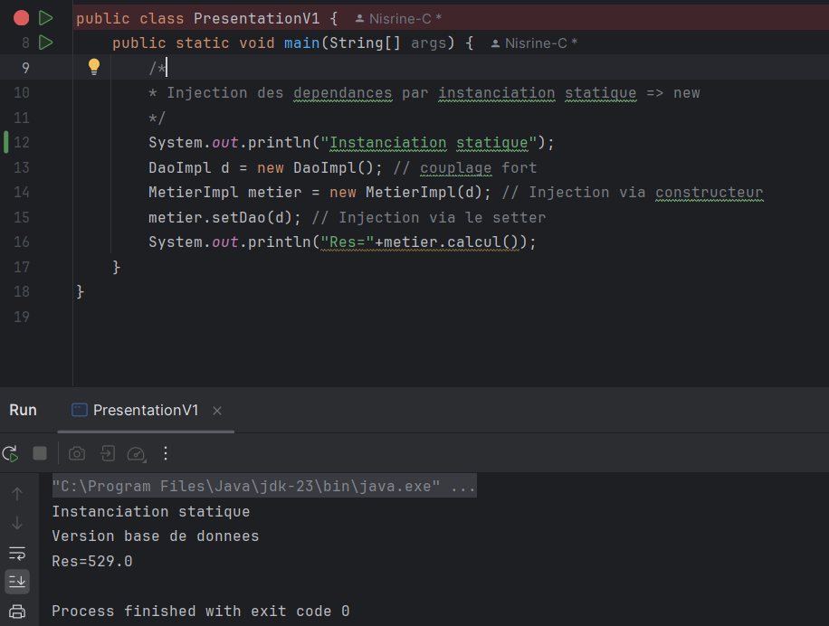
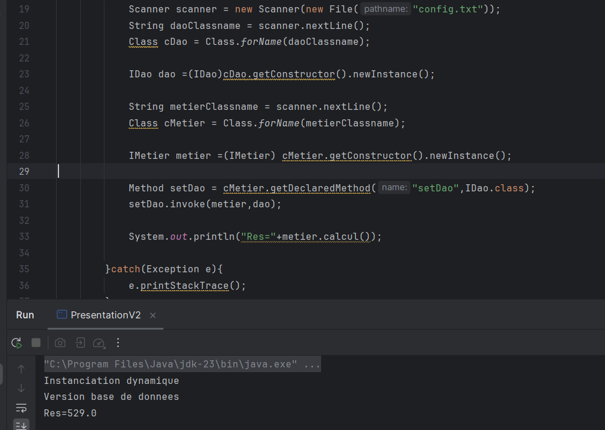
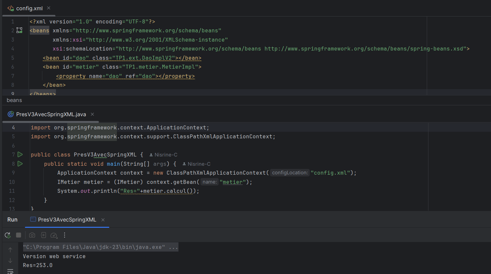
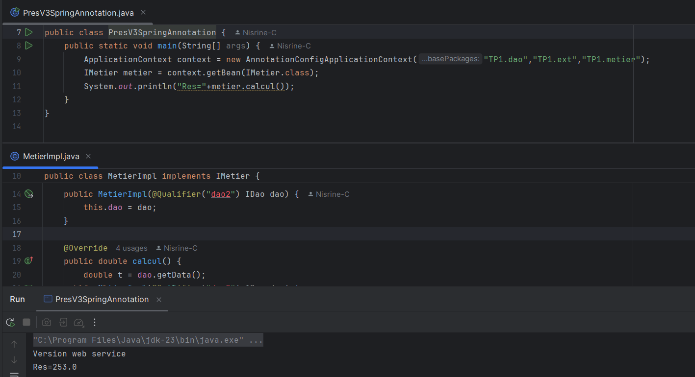

# JEE TP1: Dependency Injection

This project demonstrates three approaches to **Dependency Injection** in Java:

- **Static Instantiation**
- **Dynamic Instantiation (via Reflection)**
- **Spring Framework-based Injection** (using both XML and Annotations)

## Table of Contents

- [Project Structure](#project-structure)
- [Dependency Injection Approaches](#dependency-injection-approaches)
  - [Static Instantiation](#static-implementation--presentation-v1-)
  - [Dynamic Instantiation](#dynamic-implementation--presentation-v1-)
  - [Spring DI (XML Configuration)](#implementation-via-spring--xml-)
  - [Spring DI (Annotations)](#implementation-via-spring--xml-)
---

## Project Structure

This project is structured to showcase multiple approaches to **Dependency Injection**:

---

## Dependency Injection Approaches

### Static Implementation ( Presentation V1 )

### Dynamic Implementation ( Presentation V2 )

### Implementation via Spring ( XML )

### Implementation via Spring ( Annotations )

